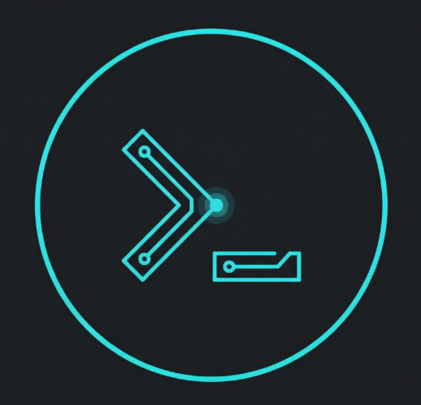

<p align="center">
  
</p>

# ai-cli

Minimal CLI to stream LLM responses via [OpenRouter](https://openrouter.ai).

- 💬 **Interactive conversation mode** — follow-up naturally, context preserved
- 📎 **File attachments** — drag & drop images or code files right into the terminal
- ✨ **Syntax-highlighted markdown** — beautiful streaming output
- 🧩 **Code extraction** — pull code blocks straight to files
- 🎨 **Image generation & display** — inline images in iTerm2
- 🔄 **Conversation continuity** — pick up where you left off with `--continue`

## Setup

```sh
npm install
npm link        # makes `ai` available globally
```

Set your API key:

```sh
export OPENROUTER_API_KEY="sk-or-..."
```

## Usage

```
ai "<prompt>" [file ...] [--model id] [--system text] [--no-stream] [--models] [--continue] [--code] [--json] [--debug] [--init]
```

### Examples

```sh
ai "explain closures in javascript" --model flash
ai "write a node http server" --code --model nano
ai "list 5 fruits" --json
ai "draw a banana" --model image
ai "describe this" photo.png                  # attach an image
ai "review these" src/app.js src/utils.js     # attach text files
ai --continue "now make it yellow"            # resume prior conversation
echo "summarize this" | ai                    # pipe input
```

### Interactive mode

After each response, you get an interactive prompt:

- **Type + Enter** — send a follow-up (drag/paste file paths to attach them)
- **Esc** — save the last response to a file
- **Ctrl+S** — save the full conversation transcript
- **Ctrl+C** — exit (conversation is persisted to config)

When piped (non-TTY), the response is auto-saved without prompting.

### Flags

| Flag | Description |
|---|---|
| `--model <alias\|id>` | Choose a model by alias or full OpenRouter ID |
| `--system <text>` | Override the system prompt |
| `--no-stream` | Wait for full response instead of streaming |
| `--models` | List available model aliases |
| `--continue` | Resume the previous conversation from config |
| `--code` | Extract code blocks on save (suggests `code.js`, etc.) |
| `--json` | Request JSON output format |
| `--debug` | Print raw request/response JSON to stderr |
| `--init` | Create a local `.ai/config.json` in the current directory, inheriting from parent |

### Models

| Alias | Model | Notes |
|---|---|---|
| `nano` | openai/gpt-4.1-nano | Cheapest, fast (default) |
| `mini` | openai/gpt-5-mini | Low-cost, good coding |
| `gpt5` | openai/gpt-5.2 | OpenAI GPT-5.2 |
| `flash` | google/gemini-2.5-flash | Gemini 2.5 Flash |
| `flash3` | google/gemini-3-flash-preview | Gemini 3 Flash (preview) |
| `pro3` | google/gemini-3-pro-preview | Gemini 3 Pro (preview) |
| `gemma` | google/gemma-3-27b-it | Google Gemma 3 27B |
| `gemma4b` | google/gemma-3-4b-it | Google Gemma 3 4B (tiny) |
| `llama` | meta-llama/llama-3.3-70b | Meta Llama 3.3 70B |
| `llama8b` | meta-llama/llama-3.1-8b | Meta Llama 3.1 8B (tiny) |
| `qwen7b` | qwen/qwen-2.5-7b-instruct | Qwen 2.5 7B (tiny) |
| `qwenvl` | qwen/qwen-2.5-vl-7b-instruct | Qwen 2.5 VL 7B (vision, charts) |
| `phi` | microsoft/phi-3.5-mini-128k-instruct | Microsoft Phi 3.5 Mini (tiny) |
| `mistral` | mistralai/mistral-small-3.2 | Mistral Small 3.2 |
| `deepseek` | deepseek/deepseek-v3.2 | DeepSeek V3.2 |
| `kimi` | moonshotai/kimi-k2.5 | Moonshot Kimi K2.5 |
| `grok` | x-ai/grok-4 | xAI Grok 4 (thinking) |
| `grokcode` | x-ai/grok-code-fast-1 | xAI Grok Code Fast |
| `haiku` | anthropic/claude-haiku-4.5 | Claude Haiku 4.5 (fast) |
| `sonnet` | anthropic/claude-sonnet-4.6 | Claude Sonnet 4.6 |
| `opus` | anthropic/claude-opus-4.6 | Claude Opus 4.6 |
| `image` | google/gemini-2.5-flash-image | Image generation (Nano Banana) |

You can also pass any full OpenRouter model ID directly: `--model anthropic/claude-sonnet-4.6`

### File attachments

Attach files as extra positional args after the prompt. Images (`.png`, `.jpg`, `.gif`, `.webp`, `.bmp`, `.svg`) are sent as base64; all other files are sent as inline text.

```sh
ai "describe this" photo.png
ai "review these files" src/app.js src/utils.js
```

In interactive mode, drag files into the terminal or paste absolute paths at the `>` prompt. Multi-file drag-and-drop is supported (bracketed paste). If you provide only file paths with no text, the default prompt "Describe the attached files" is used.

Attachments are stored in the conversation, so `--continue` re-reads the original files for context.

### Image generation

Use `--model image` to generate images. In iTerm2, images display inline. In other terminals, images are saved to disk as PNG files.

## Project structure

```
bin/ai.mjs                         CLI entrypoint
lib/markdown-renderer.mjs          Streaming markdown renderer with syntax highlighting
lib/options.mjs                    CLI flag parser
lib/response-shape.mjs             Request body shaping (JSON format, etc.)
lib/validators.mjs                 Output validators by format
```

## Config

Config is resolved in this order:

1. `.ai/config.json` in the current directory (if it exists)
2. Walk up to the nearest `package.json` and use its `.ai/config.json`
3. Fall back to current directory

Use `ai --init` to create a local config in any subdirectory. It inherits settings (model, system prompt, API key) from the nearest parent config but starts with a fresh conversation.

## Tests

```sh
node --test bin/ai.test.mjs lib/options.test.mjs lib/markdown-renderer.snap.test.mjs lib/markdown-renderer.output.test.mjs lib/validators.test.mjs
```

## License

MIT
